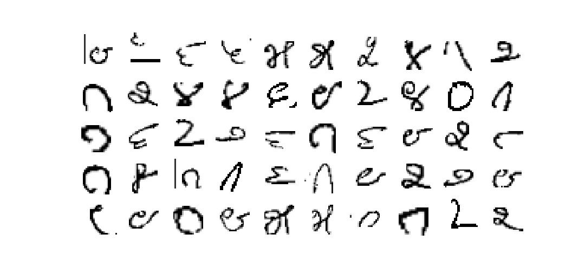
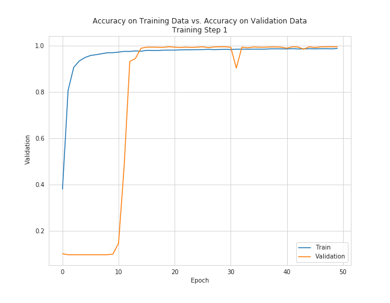
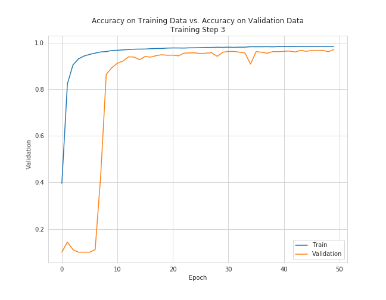

# Kannada Digit Recognition

### General Overview

The Kannada digit recognition competition is developed with the MNIST project as its inspiration. The MNIST data is a well known data set consisting of hand drawn digits, frequently used and reviewed in convolutional neural networks (CNNs). These networks are taught to accurately distinguish the digits from one another. In a twist on this original goal, [this kaggle competition][1] presents data on digits from the Kannada language, and invites competitors to build the most accurate model for identifying these new digits. In this project, I seek to accomplish exactly this goal, by creating my own CNN in order to distinguish the Kannada digits.

 Kannada is a member of the [Davidian language family][2], a group of related languages which are spoken mainly in southern India. Kannada is the third most spoke language in the family, with approximately 44 million native speakers, and roughly 56 million total speakers. The language is written using the Kannada script, with its roots in the 5th century Kadamba script. Although there are those who argue that the Dravidian languages my have been brought over to India during migrations in the fourth or third millennium BCE, or earlier, they are not easily linked to any other language family and are quite possibly indigenous to southern India [1][2]. This is all a long way of saying that the script is so different from the MNIST dataset as to be incomparable, creating the opportunity to re-invent the classic classification challenge.

This challenge both allows new data scientists to get their hands dirty building CNN models and hardened competitors to experiment with old MNIST models on new data. To this end, three data sets are presented on the [kaggle competition page][1]: a training set, `train.csv`, a validation set, `Dig-MNIST.csv`, and a testing set, `test.csv`. All three sets contain image data, with the first two also containing information labels for the images.

### Data Treatment and Augmentation
The image data for this challenge first needed transformed before it could be visualized or modeled. The original data was organized such that each row of a data frame referenced a single image, with the first column of the data showing the label of the image, and the remaining 784 columns each representing one pixel in the 28x28 pixel image. The pixel value is shown as an integer between 0 and 255, inclusive.
In order to visualize and train the convolutional neural network used in this analysis, the pixel data needed to be split from the labels and then reshaped. I also normalized the data by dividing all values by 255, such that no value in the pixel information was greater than 1. This was done to improve the accuracy of the model. Let's take a look at the images, reshaped and normalized.

The above digits are a random sample of 50 different images in the training set. One can immediately see how different they are from the images found in the MNIST data set. When compared with a separate random sample from the validation set, seen below, one can see that the training data is, seemingly, very slightly cleaner, but otherwise comparable.

I finally created two data augmentation functions, using the `ImageDataGenerator` keras utility. This utility performs random augmentations to the training data, and includes these newly augmented images in the training set to provide additional training data to the model. My generator will,
+ perform a random rotation of no more than 12 degrees
+ modify the width of the image up to no more than 25% of the original width
+ modify the height similarly to, but independently from, the width
+ shear the images (rotate the top of the image, but not the bottom, imagine a rhombus compared to a rectangle) up to no more than 12 degrees
+ perform a random zoom of the image up to 25% of the original image

### The Model
In creating this model, I decided to implement a three stage training process to best and most accurately predict the test set. In the first step the model was trained and validated on splits of the original training data. In the second the entire training set was used for training while the provided validation set was used for validation. Finally, in the third step, the training data and the validation data was concatenated to provided the largest possible training set for the model which would be used to predict the testing data.

#### Model Architecture

The architecture of the model can be seen in the `Kannada Digit Recognition` notebook.

#### Training Step 1
For this step, the training data originally found in the `train.csv` file was split into a training and testing group. The model was then trained on the training split and validated against the testing split.
At this stage the average training and validation accuracy and loss was reviewed. The below plots show the history of the accuracies and the losses found throughout the training process. Note that these plots only reflect one full training cycle for the model and that, due to the randomness inherent in the modeling process, the plots may differ somewhat from run to run. These provide some insight into the average behavior of the neural net.

  
  

#### Training Step 2
For this training step, the entirety of the training set was used as training data for the model, and the validation set, `Dig-MNIST.csv`, was used for the validation data. At this stage, the average training and validation accuracy and loss for the model was reviewed, and visualized. The plots showing the history of the accuracies and losses calculated throughout the training process can be seen below.

  
  

Both plots show a pretty notable aberrant drop/spike in the validation accuracy/loss (respectively) towards the end of the training cycle. This could be due to many factors, one prominent one being the randomness in the process mentioned above. As these behaviors are not found in the third training stage (seen below), and were not seen in any plot generated from any other training of the model, I am not extremely concerned with them at this time.

#### Training Step 3
Finally, for the third training step a concatenation of the training and validation sets was used to train the model, while the validation data, `Dig-MNIST.csv` was again used as the validation data. For this step only, the validation data was also augmented using the `ImageDataGenerator`. As with the previous two steps, plots showing the history of the accuracies and losses were generated to review the models training performance.

  
  

## Results
The final submission for this model was 98.5% accurate on the public score set, and 98.6% accurate on the private score set. I completed the competition in the top 26% of all competitors, where the margin between accuracy scores was being examined to the thousandth of a degree.

### Requirements
The dependencies for this project can be found in the `requirements.txt` file.

<!---References--->
[1]: https://www.kaggle.com/c/Kannada-MNIST/overview "Kaggle Competition"
[2]: https://en.wikipedia.org/wiki/Dravidian_languages "Wikipedia Dravidian Language Image Source"
